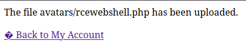
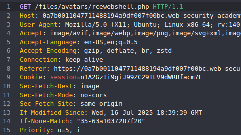
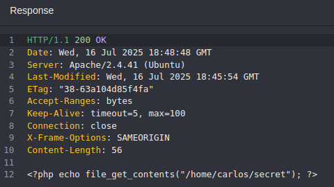
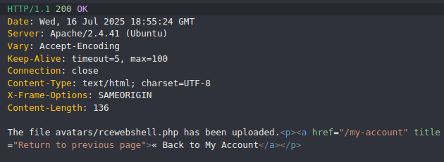
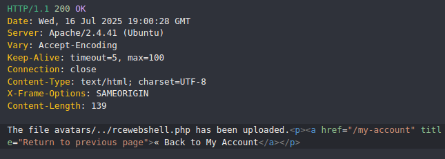
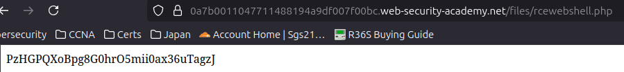

# Lab: Web shell upload via path traversal

## Challenge Information

* **Link:** https://portswigger.net/web-security/file-upload/lab-file-upload-web-shell-upload-via-path-traversal
* **Challenge Description:**   This lab contains a vulnerable image upload function. The server is configured to prevent execution of user-supplied files, but this restriction can be bypassed by exploiting a secondary vulnerability.
To solve the lab, upload a basic PHP web shell and use it to exfiltrate the contents of the file /home/carlos/secret. Submit this secret using the button provided in the lab banner.
You can log in to your own account using the following credentials: **wiener:peter** 

## Background

This lab delves into **Path Traversal (also known as Directory Traversal)**, a critical vulnerability often exploited in conjunction with file uploads. Path traversal allows an attacker to read, write, or execute files on the server outside of the intended directory by manipulating file paths with sequences like `../` (dot-dot-slash) to move up in the directory hierarchy.

When combined with file upload functionality, a path traversal vulnerability enables an attacker to upload a malicious file (like a web shell) to an arbitrary location on the server's filesystem, rather than being confined to the designated upload directory (e.g., an `avatars/` folder). This is particularly dangerous if the attacker can place the web shell into a web-accessible directory that is configured to execute server-side scripts (like PHP files), leading to **Remote Code Execution (RCE)**.

Web applications often attempt to filter or strip path traversal sequences. However, these filters can frequently be bypassed through various obfuscation techniques, most commonly by URL encoding characters (e.g., encoding `/` as `%2f` or `.` as `%2e`) or by double encoding. This highlights the necessity of robust input validation for all file paths and names, and proper web server configuration.

## Solution Steps

Upon accessing the lab, I observed a simple file upload form. The goal was to upload a web shell that could execute commands on the server to retrieve the secret file.

1.  **Logging In:**
    My first step was to log in into the user account provided. After this, it was displayed a profile section with the possibility to upload a profile image.

    

2. **Creating the Web Shell Payload:**
   I crafted a basic PHP web shell - [rcewebshell.php](scripts/rcewebshell.php)
    This payload uses the `system()` function to execute the `cat /home/carlos/secret` command, aiming to read the content of the `secret` file located in Carlos's home directory, as specified by the lab.

3.  **Uploading the Web Shell:**
    I used the provided file upload form to upload my `rcewebshell.php` file - upload successful.

    

4.  **Identifying the Uploaded File's Location:**
    After the successful upload, I used **Caido's HTTP History** to observe the subsequent requests and responses (specifically, the response to "Back to My Account"). This loads the profile with the new profile image, using a GET request to `files/avatars/rcewebshell.php`.

    

5.  **Attempting Web Shell Execution:**
    To execute the web shell, I simply navigated to the identified URL (`/files/avatars/rcewebshell.php`) in my web browser.
    However, the code was not executed, and was instead showed in plain text. This indicates that the directory is protected against server-side script execution.

    

6. **Attempting Web Shell Execution in Another Directory:**
    In order to bypass these restrictions, we can attempt to upload the payload to another directory, hoping that one will allow for server-side script execution. Using Caido, I changed the filename in the request's body to "../rcewebshell.php", and got the following response:

    

    This response indicates that the server is stripping the directory traversal sequence from the filename.

7. **Using Obsfuscation:**
    To counter these measures, I attempted to obsfuscate the directory traversal by encoding the **/** character with **%2f** - `filename="..%2frcewebshell.php"`.
    The response is shown below:

    

    Directory traversal successful.

8. **Obtaining the Secret:**
    To execute the web shell, I simply navigated to the identified URL (`/files/avatars/../rcewebshell.php`) in my web browser.
    The web server processed the `.php` file, executing the embedded command. The output of this command, which was the secret key, was then returned in the HTTP response and displayed in my browser, solving the lab.

    

## Lessons Learned

* **Path Traversal (Directory Traversal):** This lab provides a clear demonstration of how exploiting path traversal vulnerabilities (../ sequences) allows an attacker to manipulate file paths and place uploaded files in arbitrary locations outside the intended upload directory.

* **Defense-in-Depth (Non-Executable Directories):** The initial failure to execute the web shell when uploaded to the default avatars/ directory highlights a critical security measure: configuring web servers to prevent script execution in directories meant for static content. This forces attackers to find a secondary vulnerability (like path traversal) to achieve RCE.

* **Bypassing Input Filters through Encoding/Obfuscation:** Server-side filters designed to block malicious input (like ../ sequences) can often be circumvented by using various encoding schemes (e.g., URL encoding / as %2f). This underscores the need for robust, multi-layered input validation that goes beyond simple blacklisting.

* **Comprehensive File Path Validation:** Applications must strictly validate all user-supplied input related to file paths and names on the server-side, ensuring that no directory traversal sequences, whether plain or encoded, can manipulate the target file location.

* **Severity of RCE via Chained Vulnerabilities:** This lab demonstrates how combining a file upload vulnerability with a path traversal flaw can still lead to Remote Code Execution, reinforcing the critical impact of such chained exploits on server security.