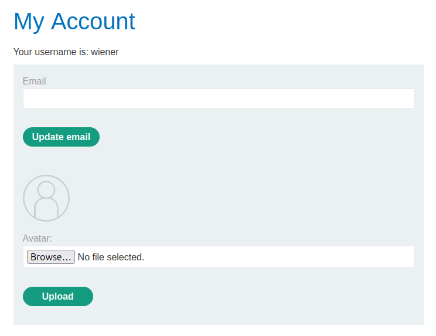
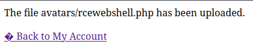
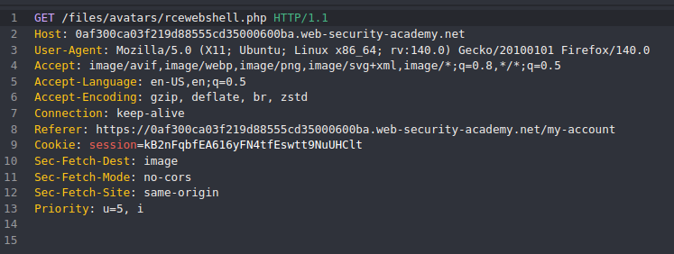
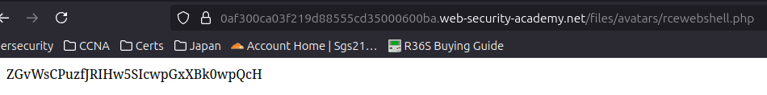

# Lab: Remote code execution via web shell upload

## Challenge Information

* **Link:** https://portswigger.net/web-security/file-upload/lab-file-upload-remote-code-execution-via-web-shell-upload
* **Challenge Description:** This lab contains a vulnerable image upload function. It doesn't perform any validation on the files users upload before storing them on the server's filesystem.
To solve the lab, upload a basic PHP web shell and use it to exfiltrate the contents of the file /home/carlos/secret. Submit this secret using the button provided in the lab banner.
You can log in to your own account using the following credentials: **wiener:peter**

## Background

This lab demonstrates a fundamental type of file upload vulnerability: **unrestricted file upload leading to Remote Code Execution (RCE)**. When a web application allows users to upload files without properly validating their type, content, or extension, an attacker can upload a malicious script known as a "web shell".

A **web shell** is a server-side script (commonly written in PHP, ASP, JSP, or Python) that provides a remote interface for an attacker to execute arbitrary commands on the web server's operating system. Once uploaded and accessed, the web shell acts as a backdoor, allowing the attacker to navigate the file system, read sensitive files, execute commands, and potentially escalate privileges.

This vulnerability is critical because it can lead to full system compromise of the web server.

## Solution Steps

Upon accessing the lab, I observed a simple file upload form. The goal was to upload a web shell that could execute commands on the server to retrieve the secret file.

1.  **Logging In:**
    My first step was to log in into the user account provided. After this, it was displayed a profile section with the possibility to upload a profile image.

    

2. **Creating the Web Shell Payload:**
   I crafted a basic PHP web shell - [rcewebshell.php](scripts/rcewebshell.php)
    This payload uses the `system()` function to execute the `cat /home/carlos/secret` command, aiming to read the content of the `secret` file located in Carlos's home directory, as specified by the lab.

    **Note on `cat` vs. `file_get_contents`**: During testing, I observed that using `system("cat /home/carlos/secret")` returned the secret content duplicated in the response. However, `<?php echo file_get_contents('/home/carlos/secret'); ?>` returned the correct, unduplicated secret. This suggests potential nuances in how the server's `system()` function handles output buffering or redirects, but either method was sufficient for RCE.

3.  **Uploading the Web Shell:**
    I used the provided file upload form to upload my `rcewebshell.php` file. Since this lab specifically focuses on *unrestricted* upload, the application did not perform any client-side or server-side checks on the file's extension or content. The upload was successful.

    

4.  **Identifying the Uploaded File's Location:**
    After the successful upload, I used **Caido's HTTP History** to observe the subsequent requests and responses (specifically, the response to "Back to My Account"). This loads the profile with the new profile image, using a GET request to `files/avatars/rcewebshell.php`.

    

5.  **Executing the Web Shell and Retrieving the Secret:**
    To execute the web shell, I simply navigated to the identified URL (`/files/avatars/rcewebshell.php`) in my web browser.
    The web server processed the `.php` file, executing the embedded command. The output of this command, which was the secret key, was then returned in the HTTP response and displayed in my browser, solving the lab.

    

## Lessons Learned

* **Fundamental File Upload Vulnerability:** This lab clearly demonstrates the most basic form of file upload vulnerability where no validation prevents the upload of malicious executable files.
* **Web Shell Basics:** Understanding how a simple PHP web shell can be used to achieve remote code execution by leveraging server-side scripting capabilities.
* **Impact of RCE:** Unrestricted file upload leading to RCE is a critical vulnerability that can grant an attacker full control over the affected web server.
* **Importance of Validation:** Reinforces the absolute necessity for robust server-side validation on all uploaded files (checking extension, content type/magic bytes, and potentially sanitizing filenames) to prevent such attacks.